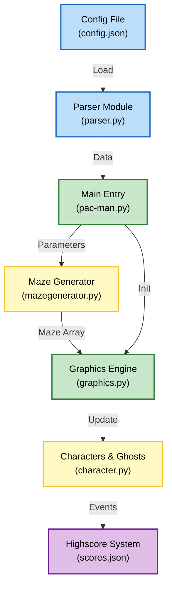
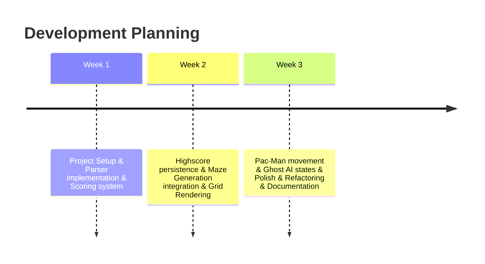

*This project has been created as part of the 42 curriculum by sservant, julcleme.*

# Pac-Man

Ghosts! More ghosts! - A dynamic Pac-Man implementation with procedural maze generation.

## Authors

- [@0xS4cha](https://github.com/0xS4cha)
- [@canarddu38](https://github.com/canarddu38)

## Result


## Description

This project is a Python-based implementation of the classic Pac-Man game, developed as part of the 42 curriculum. The core objective is to create a functional arcade experience featuring procedural maze generation, ghost AI, and a robust scoring system. It leverages the `raylib` library for graphics and real-time interaction, focusing on software architecture and algorithmic maze construction.



## Instructions

### Prerequisites
The project requires Python 3.10+ and the `raylib` library.

### Installation
Build the project using the provided Makefile:
```bash
make build
```

Install dependencies:
```bash
make install
```

### Execution
Run the game by providing the configuration file:
```bash
python3 src/pac-man.py src/config.json
```
Or via Makefile:
```bash
make run
```

## Configuration

The game behavior is controlled via a `config.json` file. 

| Key | Description | Default |
|-----|-------------|---------|
| `seed` | Random seed for maze generation | `1` |
| `lives` | Number of starting lives | `3` |
| `level_max_time` | Time limit per level (seconds) | `90` |
| `points_per_pacgum` | Score awarded for a small gum | `10` |
| `highscore_filename` | Path to the score storage | `scores.json` |

Example structure:
```json
{
    "seed": 1,
    "lives": 3,
    "levels": [
        { "name": "level1", "width": 15, "height": 15 }
    ]
}
```

## Highscore

The highscore system is designed for persistence and simplicity. 
- **Storage**: Scores are stored in a local JSON file specified in the config.
- **Implementation**: We chose JSON to ensure the data remains human-readable and easily shareable between sessions without requiring a full database.
- **Logic**: At the end of each game, the system compares the current score with the existing entries and updates the leaderboards if a new record is achieved.

## Maze Generation

This project utilizes the **A-Maze-ing package** logic to ensure every playthrough is unique.
- **Algorithm**: The generator creates a grid-based maze using a randomized approach (DFS or similar) based on the `seed` provided in the configuration.
- **Customization**: The `width` and `height` parameters from the level config allow for dynamic difficulty scaling.
- **Integration**: The `MazeGenerator` class outputs a matrix that is then interpreted by the `Graphics` module to render walls and paths.

## Implementation

The technical core of the project revolves around:
- **Collision Detection**: Pixel-perfect or tile-based detection between Pac-Man, ghosts, and walls.
- **State Machine**: Ghosts use a simple state machine (Scatter, Chase, Frightened) to emulate original arcade behavior.
- **Event Loop**: A standard `raylib` loop running at 60 FPS to ensure smooth movement and input responsiveness.

## General Software Architecture

The software is divided into decoupled modules:
- **`src/parser.py`**: Handles input validation and configuration loading.
- **`src/graphics.py`**: Pure rendering logic using Raylib surfaces.
- **`src/character.py`**: Base class for all moving entities (Pac-Man & Ghosts).
- **`src/mazegenerator.py`**: Isolated logic for grid construction.

## Project Management
The project was managed in an agile manner using sprint cycles to structure the workload. Tasks were divided into focused features like entity movement, graphics, ghost AI, shaders setup, and optimizations. For an in-depth look at our workflow, task assignments, sprint planning, and timelines, please refer to this list.
- `julcleme`: multiplayer mode, 2d textures, config system, pacgums, ghosts and character movement system using pathfinding.
- `sservant`: graphical interface, textures & models, lightning system, ghost AI, scene system, shaders and 3d scenary.

## Resources

- [Raylib Documentation](https://www.raylib.com/) — Primary graphics library.
- [Pac-Man Dossier](https://www.gamedeveloper.com/design/the-pac-man-dossier) — Understanding ghost AI and mechanics.
- [42 Curriculum](https://42.fr) — Project guidelines and requirements.
- **AI Usage**: Readme & docstring & Background image & subject comprehension

